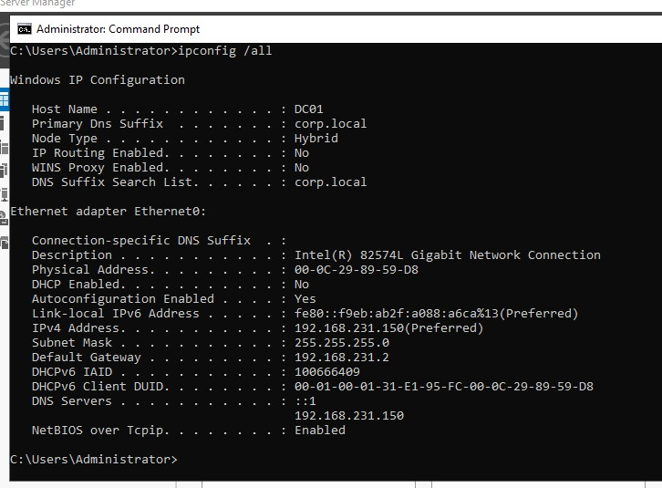
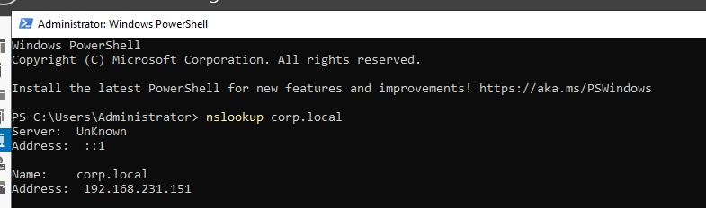
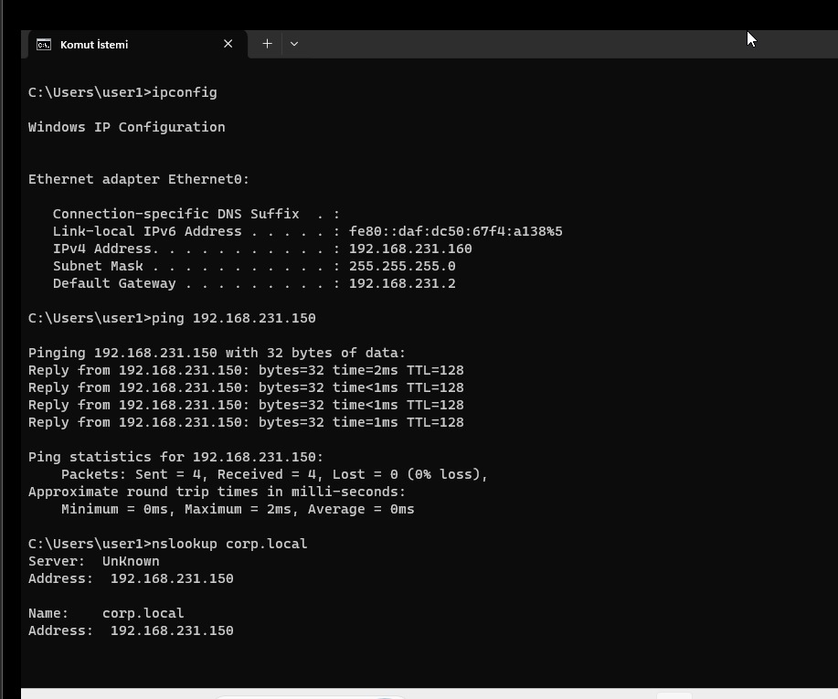
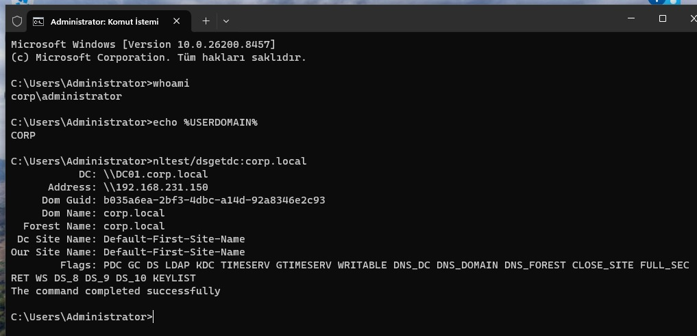
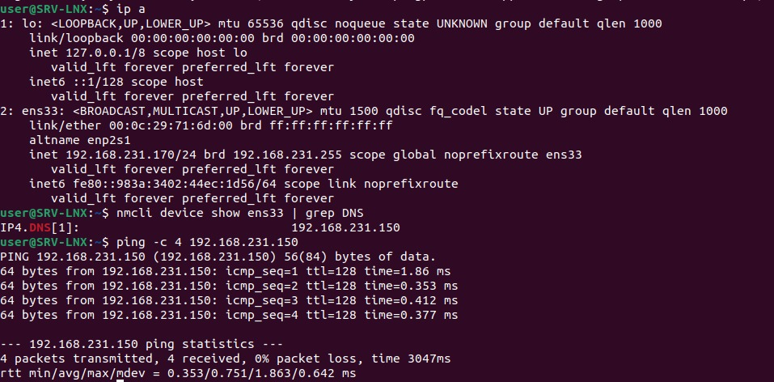
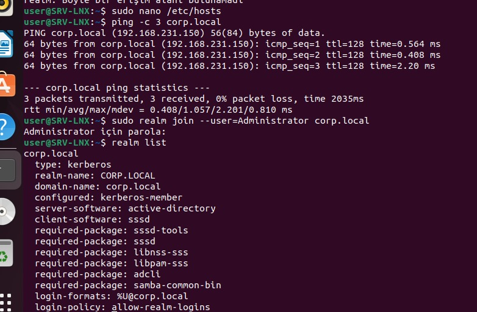
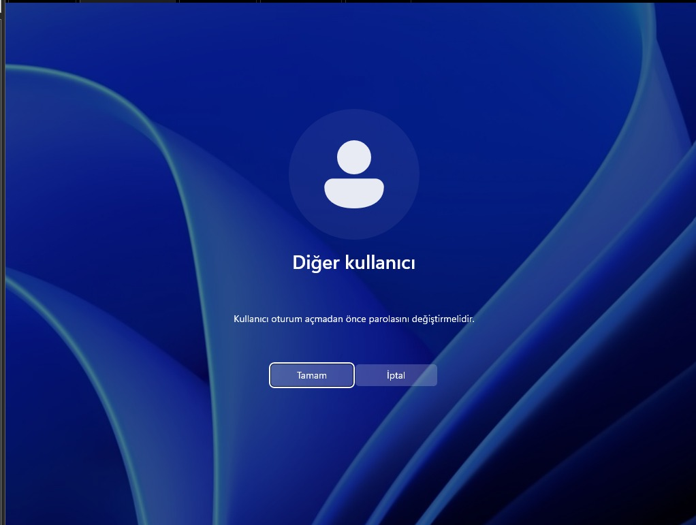
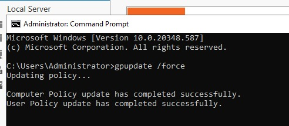

# Kurumsal Ağ Altyapısı Kurulum Projesi

Windows Server 2022 kullanılarak Active Directory, DNS, DHCP ve Grup İlkesi (GPO) yapılandırmalarının gerçekleştirildiği kurumsal ağ altyapısı laboratuvar projesidir.

## Proje Hakkında

Bu projede VMware Workstation Pro üzerinde sanallaştırılmış bir laboratuvar ortamı oluşturularak kurumsal bir ağ altyapısının temel bileşenleri yapılandırılmıştır.

Proje kapsamında;

* Active Directory Domain Services (AD DS)
* DNS
* DHCP
* Windows 11 istemcisi
* Ubuntu istemcisi/sunucusu
* Grup İlkesi (GPO)
* Sanal makine klonlama
* Sysprep ve SID yönetimi
* Domain katılımı

konuları üzerinde çalışılmıştır.

## Kullanılan Teknolojiler

* VMware Workstation Pro
* Windows Server 2022
* Windows 11 Pro
* Ubuntu 22.04 LTS
* Active Directory Domain Services
* DNS Server
* DHCP Server
* Group Policy Management
* PowerShell
* Linux Terminal

## Sanal Makine Yapısı

Projede dört sanal makineden oluşan bir laboratuvar ortamı planlanmıştır:

| Sanal Makine | Rol                           | İşletim Sistemi     |  RAM |  Disk | IP Adresi       |
| ------------ | ----------------------------- | ------------------- | ---: | ----: | --------------- |
| DC01         | Domain Controller, AD DS, DNS | Windows Server 2022 | 8 GB | 80 GB | 192.168.231.150 |
| DHCP01       | DHCP Sunucusu                 | Windows Server 2022 | 8 GB | 80 GB | 192.168.231.151 |
| CLIENT-W11   | Windows İstemci               | Windows 11 Pro      | 4 GB | 60 GB | 192.168.231.160 |
| SRV-LNX      | Linux Sunucusu / İstemci      | Ubuntu 22.04        | 4 GB | 40 GB | 192.168.231.170 |

Bu yapı proje dokümanında belirtilen sanal makine planına dayanmaktadır.

## Ağ Yapısı

Projede iki farklı sanal ağ tipinin kullanılması planlanmıştır:

* NAT: İnternet erişimi için
* Host-Only: İzole test ortamı için

DHCP kapsamı için örnek IP aralığı:

```text
192.168.231.160 - 192.168.231.200
```

## Yapılan Yapılandırmalar

### 1. Windows Server 2022

DC01 üzerinde Windows Server 2022 kurulumu gerçekleştirilerek sunucuya statik IP adresi verilmesi planlanmıştır.



### 2. Active Directory

Active Directory Domain Services kurulmuş ve `corp.local` domain yapısı oluşturulmuştur.

Domain Controller olarak:

```text
DC01
192.168.231.150
```

kullanılmıştır.

### 3. DNS

Active Directory ile birlikte DNS yapılandırması gerçekleştirilmiştir.

Domain:

```text
corp.local
```

olarak belirlenmiştir.

DNS çözümlemesini kontrol etmek için `nslookup` ve `ping` komutları kullanılmıştır.



### 4. DHCP

DHCP Server rolü yapılandırılarak istemcilere otomatik IP dağıtımı için DHCP scope oluşturulmuştur.

Örnek DHCP aralığı:

```text
192.168.231.160 - 192.168.231.200
```

### 5. Sanal Makine Klonlama

DC01 sanal makinesi klonlanarak DHCP01 isimli ikinci Windows Server sanal makinesinin oluşturulması planlanmıştır.

Klonlanan sistemde SID çakışmalarını önlemek amacıyla Sysprep ile sistem genelleştirme işlemi uygulanmıştır.

### 6. Windows 11 İstemcisi

CLIENT-W11 isimli Windows 11 Pro istemcisinin domain ortamına dahil edilmesi planlanmıştır.

```text
Bilgisayar Adı: CLIENT-W11
IP: 192.168.231.160
Domain: corp.local
```



### 7. Ubuntu İstemcisi

Ubuntu 22.04 sistemi statik IP ile yapılandırılarak `corp.local` domain ortamına dahil edilmiştir.

Domain katılımı için `realmd`, `sssd`, `adcli` ve ilgili Samba paketlerinden yararlanılmıştır.




### 8. Kullanıcı Yönetimi

Active Directory Users and Computers (ADUC) kullanılarak Organizational Unit (OU) ve kullanıcı hesaplarının oluşturulması planlanmıştır.

Kullanıcıların domain ortamında merkezi olarak yönetilmesi amaçlanmıştır.



### 9. Grup İlkesi (GPO)

Group Policy Management Console (GPMC) üzerinden GPO oluşturularak istemci bilgisayarların masaüstü ayarlarının merkezi olarak yönetilmesi planlanmıştır.

GPO kapsamında masaüstü arka planı yapılandırması ve kullanıcıların masaüstü ayarlarını değiştirmesinin engellenmesi uygulanmıştır.



## Proje Dokümantasyonu

Proje ile ilgili ayrıntılı dokümantasyon `docs` klasöründe, uygulama sırasında alınan ekran görüntüleri ise `screenshots` klasöründe tutulacaktır.

```text
docs/
screenshots/
configs/
```

## Not

Bu repository içerisinde VMware sanal makine disk dosyaları ve ISO dosyaları bulunmamaktadır.

Repository, projenin dokümantasyonu, yapılandırma bilgileri ve uygulama sırasında elde edilen çıktıları içermektedir.

## Proje Amacı

Bu çalışmanın amacı; Windows Server 2022 üzerinde Active Directory, DNS ve DHCP gibi temel kurumsal ağ servislerini yapılandırmak, Windows ve Linux istemcilerini domain ortamına dahil etmek ve Grup İlkesi kullanarak merkezi yönetim uygulamalarını deneyimlemektir.
